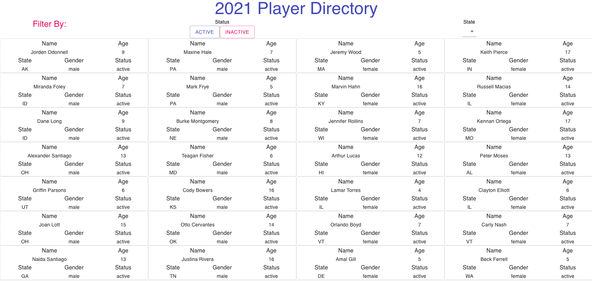

# Demosphere Debugging Test
Welcome! You have received this repo that replicates one of our existing products for Player Rosters. It contains a list of players with specific characteristics for each player like name, age, gender or which state they are from. However, due to some coding errors we are unable to run this app to see the preview as sent by the original developer. 

### Goal
* Get the app running. A successful run would show you what is seen in the preview image.
* For this test you're required to make all of the unit tests pass (see `src/App.test.js`) - without modifying the tests. 
* Make all the lint rules pass.

#### Helpful Tips:
* The dataset is loaded from https://dii-test.s3.amazonaws.com/players.json and should be accessible as an environment variable from a `.env` file.
* You may download any additional packages or libraries you might need for this project.

#### Bonus Points:

* Based on the dataset, how you would you model the backend to persist the data for rosters and players. (The answer can be in pseudocode or however you prefer.)

* If you have modeled your data, how will you design your API endpoints to get data from backend? (The answer can be in pseudocode or however you prefer.)

* If you see opportunities to refactor the code, refactor the code.

### Evaluation
Please document your changes well and make as many atomic commits as you feel are necessary for someone to track your changes.
We will be evaluating the following:

1. Adopting and using modern best practices
2. Coding style
3. Attention to detail
4. Clarity in communication
5. Robustness of testing, both manual and automatic testing
6. Ability to work with an API, Database Modeling

Thank you and Good Luck!

### Submission
Fork this repository and submit a PR/MR when you are done with your solution.
If you have any questions at all regarding the test, please create an issue in the master repo. Thank you!